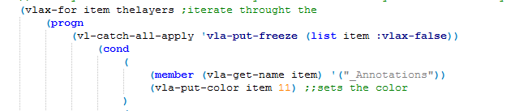
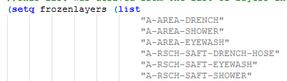
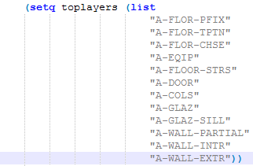
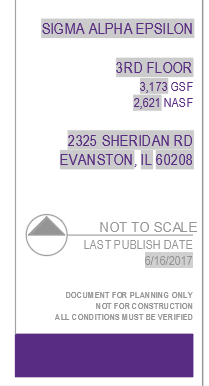
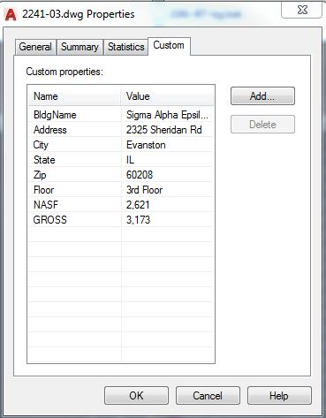

Intro
=====

The purpose of this document is to give a brief description of the
current scripts in the PDF-Publishing folder, and give details on simple
edits and troubleshooting that can be done. This instruction set was
written on 7/10/2017 for the scripts within the folder K:\\CADD\\Scripts
and Lisps\\AW Scripts\\Publishing PDFs 2.0.

Recolor
=======

**Function:** Sets the layers in the drawing that are part of our
standard layers set to be consistent with their proper colors. Thaws and
turns on a subset of these layers to be displayed in SIMS, and freezes
all other layers that aren’t x-reff’d. X-reff’d files, as they are not
names consistently, are given the benefit of the doubt and are shown.
This is because it is assumed that in most cases that any final products
will only use x-ref’s for central structural elements such as columns.
This function was mainly inspired because of a common pattern where some
people were using similar, but incorrect colors for layers when cleaning
drawings (A-ANNO-DIMS is not cyan), which will affect the plot settings.

This function also provides as snippet of code that will edit the draw
order of selected layers by systematically pushing certain layers to the
top of the draw order. At the time of writing, the current program
\*should\* leave the draw order as follows, in descending order of
priority:

1.  A-WALL-EXTR

2.  A-WALL-INTR

3.  A-WALL-PARTIAL

4.  A-GLAZ-SILL

5.  A-GLAZ

6.  A-COLS

7.  A-DOOR

8.  A-FLOR-STRS

9.  A-EQIP

10. A-FLOR-CHSE

11. A-FLOR-TPTN

12. A-FLOR-PFIX

13. All other non-frozen layers

Finally, the program will execute a subroutine (colorbylayer) that will
change all object colors to be set to bylayer.

**Editing:** Two main things can be changed easily in this file. The
first is what layer are recolored. At line 15 in the script there is a
set of lines that look like this:

The part in the red box is an example of the code snippet that changes
the color. There are several of these below the one pictured. To add a
new layer that is to be recolored (e.g. a pink layer for chemical
control zones), create a copy of that block and edit it with the name of
the layer in the place of “\_Annotations”, and change “11” to the index
number for the desired color. You can also do this on a current block of
code to change how the current system works.

The list of standard layers that are to be frozen are in line 10 (as of
writing this): 

To change the list, simply add or remove the name of a layer (in
quotes). Adding a name would only be affective in the event that you
added a new layer to be recolored using the steps in the paragraph
above, as any other layers will be frozen by default.

To change the
draw order instigated by this file, look for the list of floor names
beginning on line 122 (as of writing this:

In theory, the program will go through this list in the order that the
layers are listed, and send each one to the front. In this way,
A-WALL-EXTR will end up as the topmost layer, while A-FLOR-PFIX will be
behind all the subsequent layers, but ahead of any layers not listed. To
add layers, or edit the order, simply add in a line (keep the
formatting!) into the list of the layer name in the appropriate place).
It should be noted that this layer assumes that the listed layers are
thawed, and occurs after the freezing of other layers, so adding layers
without ensuring that they’re thawed at this point in the script may
lead to errors.

Update Custom Fields.lsp
========================

**Function:** creates an autocad command called “UpdateFields”. This
command queries the FMB0 database for the following values:

-   bdlgDescl (building name)

-   address

-   city

-   state

-   zip

The script will then query the FML0 database for the following values:

-   floordesc (floor name)

-   assignable (NASF value)

These
values are then loaded into the metadata of the dwg file as a custom
property. These can be seen by typing “DWGPROPS” into autocad for a
given drawing. These data is similar to how a music file can store
information about the song’s author. The default FMINTERACT layout is
formatted so the the text in the table is generated from these custom
properties. If these properties are not present, that table will simply
display “\#\#\#\#\#\#” where that info should be.

To do this, the lisp will actually delete any current custom fields in
the drawing, and then reload the values that were just saved in the
drawing. This is relevant, as if this command is run without the “Update

**Editing:** This script has two parts that could theoretically be
edited without largely changing their function. The first is what
information is stored as custom fields. This would be useful in the
event that the field names in the databases are changed, or if the
titleblock is edited to include different information.

Properly editing those value is beyond the scope of this document, as it
would be too easy for me to improperly explain and leave the user to end
up with a non-function drawing.

Update Areas.lsp
================

**Function:** creates an autocad command called “UpdateAREAS”. This
command calculates the total area of each of the A-POLYLINE,
A-POLYLINE-EXT, and A-POLYLINE-INT layers and saves them as variables in
the script. The A-POLYLINE-EXT area is then put into the drawing’s
custom properties under the “GROSS” name. Additionally, the
A-POLYLINE-INT area is put into the “Measured SF” custom property. It
should be noted that this property is new and will not be in the title
block nor in drawings that this updated script hasn’t been run on before
(i.e. before 7/7/2017)

**Editing:** This script uses the same basic function for each area
calculation and saves them in different variables: “gsf” -&gt; gross
square feet, “msf” -&gt; measured square feet, and “nsf” -&gt; net
square feet. If future changes to the title blocks are done that can use
this extra data, they can be used to be put into the drawing in a way
similar to how the GROSS property is done.

Publish-PDF AW
==============

**Function:** This script is the main one that publishes the drawing to
SIMs using a custom command “FMINTERACT-PDF”. The first part of the
script uses the drawing file’s name and runs a query on the FMB0
database to get the building site code. The building site code and the
building number are used to generate the correct path for the PDF that
this script will publish to.

**Editing:** The most important part of this script is a simple line
that does all of the printing commands. As of writing this the line
looks like this:

(vl-cmdf ".-plot" "Y" layout plotout paperstyle "INCHES" "landscape" "N"
"layout" "1=1" "0.13,0.12" "Y" plotstyle"N" "N" "N" "N" (strcat
parentfolder bldgSitecode "\\\\" floorNum ) "y" "y")

This is the line that runs the –plot command in autocad (vl-cmdf is a
special version for lisp). The following quoted items are the inputs
that are put into the command line as autocad asks for the specific plot
settings. To make editing easier, several of these values are strings
that are defined at the top of the lisp. The section that defines these
looks like this:

These could easily be edited to change the setting of the plot for the
future by changing the test within the quotations. When the lisp runs,
it will replace each variable with the string given after it in quotes.
E.G. layout in the last part of the script will be replaced internally
with the line “FMINTERACT”. As of writing this, I’ve listed what the
command line will see when the script is run. The *underlined* parts are
where the variable are given. You can change these responses by changing
the lines at the top of the lisp file .

E.G. to change:

“Enter a layout name -&gt; FMINTERACT” to “ENTER a layout name -&gt;
FACILTIESCONNECT”

Change:

(setq layout “FMINTERACT”) to (setq layout “FACILITIESCONNECT”)

The default prompt is as follows.

-   Detailed plot configuration? -&gt; Y\[es\]

-   *Enter a layout name -&gt; FMINTERACT*

-   *Enter an output device name -&gt; DWG to PDF.pc3*

-   *Enter paper size -&gt; ANSI full bleed B (11.00 x 17.00 Inches)*

-   Enter paper units -&gt; Inches

-   Enter drawing orientation -&gt; Landscape

-   Plot upside down? -&gt; N\[o\]

-   ***\*Enter plot area -&gt; extents***

-   Enter plot scale -&gt; 1=1

-   Enter plot offset -&gt; 0.13,0.12

-   Plot with plot styles? -&gt; Y\[es\]

-   *Enter plot style table name -&gt; Nu plotstyle.ctb*

-   Plot with lineweights? -&gt; N\[o\]

-   Scale lineweights with plot scale? -&gt; N\[o\]

-   Plot paper space first? -&gt; N\[o\]

-   Hide paperspace objects -&gt; N\[0\]

-   *Enter file name -&gt; (strcat "Z:\\\\fminteract
    8\\\\fminteract\\\\" bldgSitecode "\\\\" floorNum )*

    -   This is a use of a concatenation of different variables. The
        first part is the main file path to the Z:\\fminteract
        8\\fminteract folder (you need an extra “\\” when working in
        lisp), the variable for the building site code that the script
        generates, another “\\”, and the floor number. This will create
        a full file path. The Name of the file will be
        &lt;floorNum&gt;.pdf, and will be in the Z:\\fminteract
        8\\fminteract\\&lt;building site code&gt; folder.

-   Save changes to page setup -&gt; Y\[es\]

-   Proceed with plot? -&gt; Y\[es\]

\*There are a few times when the prompt will have extra prompts that
aren’t handled in the script. The script assumes that the prompt “Enter
plot area” *doesn’t* appear. In some circumstances it will, and in those
cases the script will fail. There are also situations where there will
be additional prompts at the end of the script. If the script is
failing, try running “FMINTERACT-PDF” and see if there are still command
line prompts after terminating. In this event, this is likely the
culprit.

Other Scripts
=============

The “Publishing PDFs 2.0” folder has some additional scripts and lisps
in them, which are mostly variants of the main files:

-   Publish-PDF Local AW: Script and lisp that was used for testing. The
    plotting location is changed to the default directory for printing
    to pdf for autocad, and the plotstlyle is changed. The resulting
    lisp function is renamed to FMINTERACT-LOCALPDF

-   Update Titleblock: Runs the publishing script without the
    FMINTERACT-PDF function, which will auto turn on/off the layers, and
    fill out the needed data for the titleblock, but won’t publish.

-   Publish without updating: Runs the script to turn on/off the layers
    and publishes, but doesn’t update any data used in the title block.

-   FMlayers: Will load all of the standard layers (as of writing this)
    into a CAD drawing, and reformat any existing standard layers to be
    a proper color. This is designed to streamline the process of taking
    in a new drawing; simply type in “FMlayers”, and all the layers you
    need will be loaded into CAD.

-   Srecolor: Similar to the recolor file, but doesn’t freeze
    any layers. Intended for individual use to make integrating files
    more easily. Once it’s loaded (I put it in my startup suite), simply
    type “srecolor” into the command line.

-   Stddims:

    -   Changes setting on all of the dimension properties in a drawing
        to be more standardized.

-   Pclose:

    -   Closes polylines on any A-POLYLINE related layers.

-   Fmclean: navigates to the model view, zooms to the extents, and
    proceeds to run the following CAD commands on the entire drawing:

    -   Overkill

    -   Purge

    -   Hatchfix

        -   Changes all hatches to solid

        -   Changed setting to “outer island detection”

    -   Recolor (custom)

        -   Fixes any colors of standard layers

    -   Stddims (custom)

        -   Reformats dimensions

    -   Pclose (custom)

        -   Closes all polylines on polyline related layers

